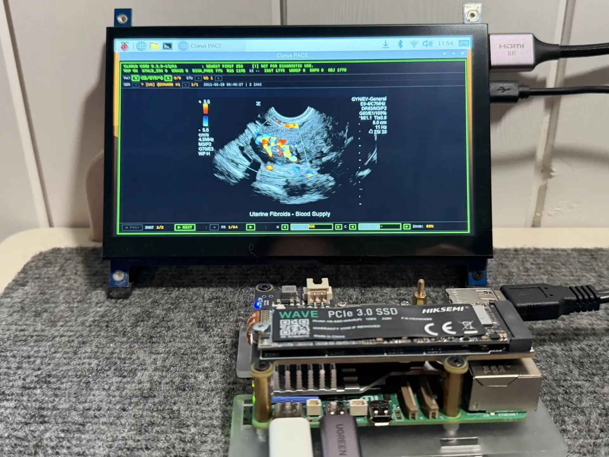
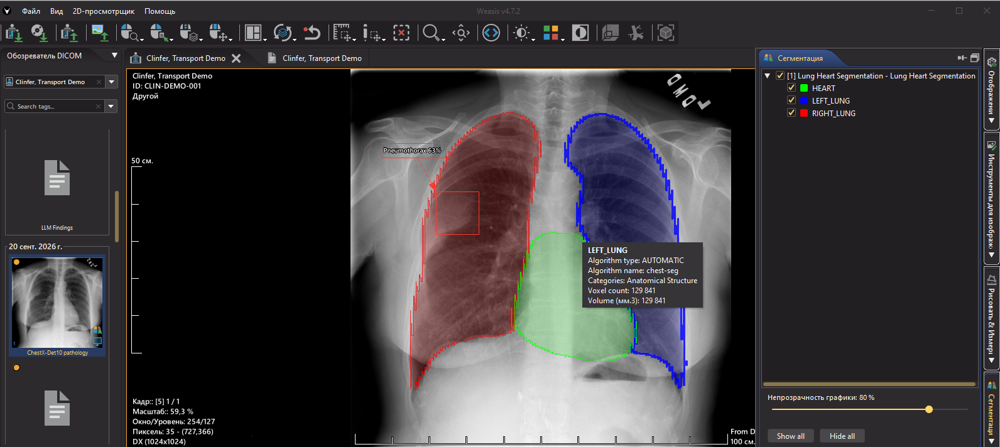

# Clarus PACS

> A standards-complete DICOMweb archive with a minimal core.

Clarus is a DICOMweb PACS server (QIDO-RS, WADO-RS, STOW-RS, UPS-RS,
Storage Commitment) written in Rust. It conforms to PS3.18 2026c, IHE
AIW-I Rev 1.1, and PS3.2. It does this without SQL, without an external
database, and with no runtime dependencies: no database server, no JVM,
no interpreter, no async runtime.

## Why it exists

Clarus began inside ClarityX, a two-workstation DX room with
fluoroscopy: the viewer and the lab assistant's arm. Planning showed the
DIMSE integration would take the longest, so the archive was split out
into its own project. The first implementation used SQLite and the Tokio
async runtime - it was ready very quickly, and it was the wrong shape.
Instead of adding a faster database, we removed the database. Instead of
adding more RAM, we removed the async runtime. Instead of adding a
cluster, we made the archive stateless. What was left was small enough
to fit on a couple of floppies - and fast enough for a city archive.

### Principles

1. Everything is a file (Unix).
2. Data structures matter more than code (Torvalds).
3. No optimisation without a measurement (Pike).
4. The fastest code never executes (Galanakis).
5. Simplicity takes work; complexity sells better (Dijkstra).
6. Controlling complexity is the essence of programming (Kernighan).
7. Simplicity is when you understand the system (Thompson).

## What it is

- **DICOMweb**: QIDO-RS, WADO-RS, STOW-RS, UPS-RS, Storage Commitment
  (PS3.18 2026c)
- **AIW-I**: Task Manager (Clarus) + Task Performer (clinfer), Pull +
  Triggered Pull
- **DIMSE bridge**: C-STORE, C-FIND, C-MOVE, N-ACTION, C-ECHO.
  **Registry-driven** (`sop_classes.yaml`): the field build ships with 72
  SOP classes covering the installed base; adding a new SOP class is a
  YAML edit, not a code change.
- **Content-addressed storage**: BLAKE3, no SQL, no WAL, atomic renames
- **Verifiable Storage Commitment**: per-instance success = SOP UID in
  the manifest, frame-chunk table embedded in the CAS
- **Fuzzy search**: Bitap + n-gram index, O(candidates), zero heap
  allocation
- **CJK (opt-in build)**: GB18030 / KS X 1001 / ISO 2022 IR 13/87 via the
  `cjk-charsets` feature; SM3 content-addressing (planned, customer-demand)

**The inversion.** DICOMweb is the CORE; DIMSE is a removable BRIDGE -
the opposite of the usual layering, where DICOMweb is added as a facade
on top of a DIMSE server. Storage Commitment lives in the core (PS3.18
Section 13), so a modality can complete its full cycle - STOW plus
Commit - over DICOMweb alone; DIMSE is no longer the only path to
commitment. The bridge is transit, not foundation: the day the last
DIMSE-only modality is retired, `clbridge` is removed and the archive is
unchanged.

**Why this matters.** Orthanc and dcm4chee-arc began as DIMSE servers
and added DICOMweb as a facade: for them DIMSE is the foundation and
DICOMweb the presentation. Clarus is the inverse - evolution happens in
the core (AIW-I, Storage Commitment, UPS-RS land without touching the
bridge). DIMSE will live as long as the installed base of DIMSE-only
modalities does - a 10-15 year horizon. Clarus is built for the world
after: DICOMweb-first, with DIMSE as a removable bridge. We do not
"kill" DIMSE; we remove the reasons it has to exist.

## How it compares

| | Clarus | Orthanc | dcm4chee-arc |
|---|---|---|---|
| **DICOMweb** | PS3.18 2026c, all mandatory transactions CONFORMANT | DICOMweb plugin (STOW/QIDO/WADO-RS) | STOW/QIDO/WADO-RS, full REST |
| **Storage Commitment** | **Verifiable** (SOP UID in manifest, frame-chunk table in CAS) | Plugin, declarative | Present |
| **IHE AIW-I** | **Task Manager + Task Performer CONFORMANT** | No | Not claimed as a profile |
| **DIMSE** | Registry-driven YAML, 72 SOP classes shipped | Fixed set | Full IHE profile, tied to RDBMS |
| **SQL** | None | SQLite | PostgreSQL / Oracle |
| **Runtime** | ~2 MB binary (base build), ~5-13 MB RAM; no async runtime, thread-per-connection | C++ binary, ~GB RAM | JVM + WildFly, ~GB RAM |
| **Fuzzy search** | Bitap + n-gram, O(candidates), zero heap | SQL LIKE | SQL / Lucene |
| **CJK** | GB18030 / KS X 1001 / ISO 2022 IR 13/87 (opt-in `cjk-charsets` build), SM3 (planned) | Depends on build | Java charsets, no SM3 |
| **HL7 / order management** | Sidecar (planned) | - | Full IHE profile |
| **Plugin ecosystem** | Sidecars, not plugins | Large | Moderate |
| **Maturity** | Closed preview | Mature open source | Production, commercial support |

**Where Clarus wins:** AIW-I, verifiable Storage Commitment, no SQL, no
async runtime, content-addressed storage, fuzzy search, CJK.

**Where Clarus is weaker:** HL7/order management, plugin ecosystem,
maturity, commercial support.

**Where it can compete:** Orthanc's niche (lightweight DICOM server) -
no SQLite, AIW-I, verifiable commitment. dcm4chee's niche (hospital
archive) - no JVM, no RDBMS, AIW-I, verifiable commitment. For
HL7/order management, dcm4chee remains the reference today; a Clarus
sidecar is planned.

## Architecture

**Stateless compute over shared storage.**

- **Clarus (core)**: DICOMweb server, content-addressed storage, UPS-RS
  Task Manager. One binary. No SQL, no async runtime, no runtime
  dependencies. Synchronous thread-per-connection HTTP stack; timeouts
  and backpressure are ours, not a runtime's.
- **clbridge (sidecar)**: DIMSE-to-DICOMweb gateway. SCP for C-STORE /
  C-FIND / C-MOVE / N-ACTION; SCU for C-STORE outbound. Stateless.
  Scale by adding bridges.
- **clinfer (sidecar)**: AI processing. Claims UPS-RS workitems, runs
  site-supplied models under a model-agnostic contract (workdir +
  manifest.json -> result.json), stores results back with STOW-RS.

Sidecars communicate with the core over standard protocols. They are
not plugins: no shared memory, no linked code. Replace, restart, or
scale them independently.

**Scale-out shape:** N bridges, one Clarus core, one shared CAS. The
bridge side scales with the number of bridges; the shared STOW path is
the cap.

## Verification

Every release passes the public
[ap101](https://github.com/clicker71/ap101) hot-path harness before it
ships. Hot paths are verified, not assumed.

The harness is MIT-licensed and already open. It is the gate, not a
badge: the Clarus source repository opens when this bar holds, not
before.

**Universal A/B harness:** [`ab_test.py`](tools/ab_test.py) - point it at any
DIMSE or DICOMweb server. It discovers the throughput plateau itself
(adaptive window, outbox drain polling, DIMSE retry hygiene). The
benchmark numbers in this README were produced by this harness; anyone
can reproduce them.

**What ap101 verifies:**

- STOW-RS hot path: multipart parsing, BLAKE3 hashing, atomic rename,
  manifest commit
- WADO-RS hot path: page-cache streaming, multipart assembly,
  transfer-syntax passthrough
- QIDO-RS hot path: n-gram pre-filter, Bitap matching, K-way merge
- DIMSE bridge hot path: C-STORE acceptance, outbox drain, C-MOVE
  delivery
- UPS-RS hot path: workitem claim, state machine, notification delivery

**Why this matters:** conformance statements declare what the system
does. ap101 verifies that it does it under load. Both are public.
Neither requires trusting the source repository.

## Deployment

- **One static binary** (about 2 MB in the base build), no runtime
  dependencies. No VCRedist, no JVM, no interpreter.
- **~6 MB RSS** on Windows, **8-13 MB on Raspberry Pi 5** in the base
  build.
- **`transcode` build** adds codecs (JPEG-LS, JPEG Baseline/Lossless,
  JPEG 2000, RLE). Idle RSS unchanged; transient buffers during
  conversion.
- **`s3` build feature**: cold-tier fallback.
- **`cjk-charsets`**: opt-in build feature, NOT in the default build; a
  separate release variant ships with it. Without it, CJK text is not
  decoded (see the DICOMweb conformance statement).
- **`china_crypto`**: planned (SM3 content-addressing).

**Validated deployments:**

- Bare metal (Windows, Linux x64)
- Raspberry Pi 5 (Cortex-A76, 2 GB RAM, NVMe over PCIe 2.0 x1)

*Clarus on a Raspberry Pi 5 (2 GB RAM, NVMe) with the inline ~30 KB
mini-viewer at `/` - a visual ping for the service engineer/admin.*

- VM (VMware, 3 vCPU, 32 GB RAM, HDD-backed)

The wall is the network and the disk, not the CPU.

## AI pipeline (clinfer + ABI)

`clinfer` is a UPS-RS Task Performer (IHE AIW-I Triggered Pull). It
claims workitems from Clarus, runs a site-supplied model script under a
model-agnostic contract, and stores results back with STOW-RS.

**The model never sees DICOM.** Per study, `clinfer` lays out frames as
raw pixel arrays plus a `manifest.json`. One run: the script (Python,
C++, OpenVINO - any executable) runs in a separate OS process with
timeouts and returns one `result.json`. `clinfer` validates geometry
byte-for-byte and assembles standard DICOM objects.

**One pipeline, all result types:**

- **SEG** - pixel masks of organs
- **SR** - structured findings (including from local LLMs)
- **PR (GSPS)** - overlays: boxes and contours
- **Derived** - enhanced images (super-resolution, CLAHE)
- **RTSTRUCT** - vector contours
- **SR (TID 1500)** - AI measurements: per-class probabilities and the
  model's own operating thresholds as NUMs

The object names its own producer: the segmentation carries Segment
Algorithm Name (0062,0009), the script that computed it.

**Rules-guarded claim:** `clinfer` matches the study against configured
model rules (study tags - modality, body part, and the like) and cancels
a workitem no rule accepts. A chest model never receives knees: the
mismatch is refused before the first frame is read.

See [`totalseg-demo/README.run.md`](totalseg-demo/README.run.md) for a
working end-to-end pipeline.

*The AI pipeline output in one study, rendered by Weasis: the SEG
overlay, the PR measurements and the SR series - the illustration of
the result types listed above.*

## FAQ

**What happens if the server loses power mid-write? Is there a WAL?**

No WAL, deliberately: the B-tree never rewrites data in place, so there
are no torn pages to journal. Instance bytes are streamed to a temp
file, hashed with BLAKE3, fsync'd, and atomically renamed to their
content-addressed path; the per-study CBOR manifest is committed with a
single atomic rename. Readers see either the old state or the new
state, never a partial one, and BLAKE3 doubles as the integrity check
on every read. A `200 OK` is sent only after the manifest commit.
Honest limitation: the manifest file itself is intentionally not
fsync'd; on some filesystems a just-committed manifest may be lost in a
power cut, while the instance bytes remain in the CAS and are detected
by their hash.

**How does the engine scale to 10 million images?**

10M images ~ 300-400K studies. Retrieval is O(1): the BLAKE3 hash
directly addresses a file in a two-level sharded layout - no index
lookup. Ingest is O(1) per study: one append + one atomic rename.
QIDO by StudyInstanceUID is O(1); by modality/date it is O(candidates)
through day-bucket `.idx` files; fuzzy name search is O(candidates)
through an n-gram candidate index + bitap matcher. Queries without an
accelerator are O(n) in RAM over the study index; the disk is scanned
only while that index builds lazily. Memory: pixels never enter process
memory (page cache -> socket), so base build RSS stays at ~6 MB on
Windows and 8-13 MB on a Raspberry Pi 5.

**Where is the monitoring web panel? Where are the performance dashboards?**

There is no bundled dashboard, on purpose. Clarus does one job - moving
and storing pixels - and does it well. Monitoring is a separate product
category with recognised leaders (Prometheus, Grafana). Every component
exposes a Prometheus-style `/metrics` endpoint, plus `GET /health` and
`GET /version`:

- `clarus` - `/metrics`, `/health`, `/health/status`, `/version`
- `clbridge` - `/metrics`, `/health`, `/version`
- `clinfer` - `/health`, `/metrics`, `/version`, `/processors`

Point Prometheus at these endpoints and build dashboards in Grafana.
The engine stays small precisely because it does not grow a web UI of
its own.

## Status

**Closed preview (pre-release).** Internal testing and field validation
are in progress; the source repository stays private until that bar
passes, then opens under LGPL-3.0. Closed preview is a quality gate,
not a business model.

**What is public now:**

- Viewer interoperability: Weasis field report
  ([`weasis-report.md`](weasis-report.md)); MicroDicom and OHIF covered
  by closed tests
- AI results pipeline: SR + PR + SEG + derived in one study, rendered
  by Weasis
- DIMSE throughput benchmark vs Orthanc ([`benchmark.md`](benchmark.md))
- Conformance statements:
  [DICOMweb](dicomweb-conformance-statement.md),
  [DIMSE bridge](dimse-bridge-conformance-statement.md),
  [IHE AIW-I](aiw-i-conformance-statement.md)
- Public test artifacts: [ap101](https://github.com/clicker71/ap101),
  [`tools/ab_test.py`](tools/ab_test.py)
- Bug reports against third-party DICOM tooling

**What is not public yet:** source code and binaries; documentation is
published gradually as it stabilizes.

## Roadmap

- **HL7 / order management** - sidecar (planned, customer-demand)
- **`china_crypto`** - SM3 content-addressing (planned, customer-demand)
- **Push workflow** (AIW-I) - planned, customer-demand
- **Model-version provenance** (Type 3) - planned, customer-demand
- **MCP server** (`clarus-mcp`) - proposed, not committed

## Links

- [Weasis field report](weasis-report.md)
- [DICOMweb conformance statement](dicomweb-conformance-statement.md)
- [DIMSE bridge conformance statement](dimse-bridge-conformance-statement.md)
- [IHE AIW-I conformance statement](aiw-i-conformance-statement.md)
- [Universal DICOM A/B harness](https://github.com/clicker71/ap101)
- [End-to-end demo](totalseg-demo/README.run.md)

## Trademarks

DICOM(R) is the registered trademark of the National Electrical
Manufacturers Association (NEMA) for its standards publications
relating to digital communications of medical information. DICOMweb(TM)
is a trademark of NEMA. IHE is a trademark of Integrating the
Healthcare Enterprise (IHE International). Clarus is not affiliated
with or endorsed by NEMA or IHE.

## Medical device disclaimer

Clarus is experimental software intended for research, development, and
interoperability testing. **Not for clinical diagnostic use.** No
regulatory approval (FDA 510(k), CE MDR, or equivalent). The authors
and contributors assume no liability for any use, misuse, or
consequences. By using this software you agree that you are solely
responsible for compliance with applicable laws and regulations.
