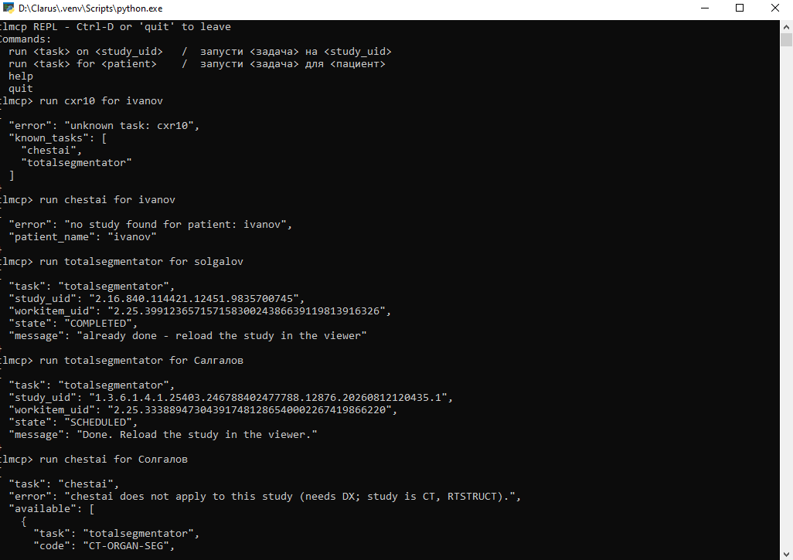
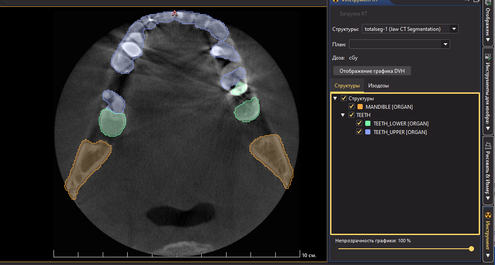

# Clarus totalseg demo pack — run guide

A self-contained demo of an AI pipeline over DICOMweb: **clarus** (a tiny
DICOMweb PACS), **clinfer** (an inference sidecar), the **ABI producer
scripts**, and **clmcp** (a demo Task Requester).

NOT FOR DIAGNOSTIC USE. This is transport plus research models; no clinical
claim is made or implied.

## What you get

- `clarus(.exe)` — one-file DICOMweb server (QIDO/WADO/STOW/UPS-RS)
- `clinfer(.exe)` — inference sidecar (claims workitems, runs producers,
  writes results)
- `clarus.conf` — **default** server config (Clarus is Task Manager only)
- `task_producer.conf` — server config where **Clarus also mints workitems**
- `clinfer_demo.conf` — sidecar config for the totalseg rule (minimal)
- `clinfer.conf.example.en` — the full annotated sidecar config (every option)
- `abi/` — the example producers (below)
- `ABI-README.md` — the producer contract (frames + manifest.json in,
  result.json out)
- `clmcp/` — the demo Task Requester (agent/MCP REPL)
- `../images/totalseg_demo.png` — the RTSTRUCT result in Weasis
- `../images/screenshot-clmcp.png` — the clmcp REPL in action

## The two modes (pick one)

UPS-RS has three roles: **Task Manager** (always clarus), **Task Performer**
(always clinfer), and **Task Requester** — the role that can be anyone. The
pack ships two server configs that differ in exactly one knob, `task_producer`:

| Config | `task_producer` | Who creates workitems |
| --- | --- | --- |
| `clarus.conf` | `false` | external — clmcp, a modality, a RIS |
| `task_producer.conf` | `true` | Clarus itself (auto-mint on STOW) |

### Mode A — Clarus as Task Producer (no requester needed)

```
./clarus --config task_producer.conf
./clinfer --config clinfer_demo.conf
curl -X POST http://127.0.0.1:8024/dicomweb/studies \
     -H "Content-Type: application/dicom" --data-binary @slice.dcm
```

STOW → Clarus mints a CT workitem → clinfer claims it → totalseg runs →
RTSTRUCT back. Open in Weasis.

### Mode B — external Task Requester via clmcp

```
./clarus                        # clarus.conf is the default config
./clinfer --config clinfer_demo.conf
python clmcp/clmcp.py --chat
```

Push your own CT study first (STOW-RS, see Mode A), then in the REPL:
`run totalsegmentator for <your patient>`. clmcp creates the workitem over
standard UPS-RS (`POST /workitems`), exactly as a modality or a RIS would.

## The configs are the guide

`clarus.conf` is deliberately self-documenting: every knob carries a comment
that says what it does, why the default is what it is, and when you would
change it. Read it top-to-bottom as the deployment/operation manual. The knobs
that matter for this demo are `task_producer` (above) and the workitem catalog
(the AI task vocabulary, read only when `task_producer` is on).
`clinfer_demo.conf` is the minimal totalseg wiring: `models:` entry, the rule
table, interpreter path, timeout. `clinfer.conf.example.en` documents every
option the sidecar accepts.

## The ABI producer scripts (`abi/`)

Each script is an ordinary program: clinfer hands it a workdir
(`manifest.json` + `frames/*.raw`), it writes back one `result.json`, and
clinfer writes the DICOM object. A producer never sees DICOM — the contract
is `ABI-README.md`.

- `openvino_detect.py` — OpenVINO detector; boxes over every frame → **PR**
  (presentation state).
- `sr_llm.py` — calls an OpenAI-compatible endpoint; returns `sr.text` →
  **SR** (structured report).
- `totalseg.py` — TotalSegmentator (craniofacial structures) → **RTSTRUCT**.
- `stl_mesh.py` — the reference **STL** mesh producer (seg/stl bridge).
- `xrv.py` — chest X-ray classifier; 18 pathology probabilities → **TID 1500**
  Enhanced SR measurements.

Also shipped: `threshold_seg.py` (segmentation), `rtstruct_contours.py`
(license-clean RTSTRUCT contours), `clahe.py` / `upscale.py` /
`opacity_patch.py` (image filters), `xrv_seg.py` / `xrv_regions.py` (X-ray
anatomy), `manifest.example.json` (input shape), `requirements.txt`.

> **TID 1500 in Weasis — known upstream bug.** The SR measurement viewer
> (Enhanced SR SCOORD) has two upstream display bugs we filed —
> [nroduit/Weasis #922](https://github.com/nroduit/Weasis/issues/922) and
> [#923](https://github.com/nroduit/Weasis/issues/923) — which the maintainer
> took upstream and fixed as
> [#931](https://github.com/nroduit/Weasis/issues/931) ("Refactor SR
> rendering…", milestone 4.8.0). Until 4.8.0 ships, render TID 1500 results
> with that caveat. The `totalseg.py` → RTSTRUCT contour path is unaffected
> (verified in Weasis 4.7.2, RT tool).

## Observing a run

Everything in the chain is observable without a debugger:

- **Server log** (`clarus.log` + stderr): `UPS_EVENT` lines name every state
  transition (created → SCHEDULED → IN PROGRESS → COMPLETED); `WADO_SERIES`
  shows the study fetch as one line per series (`slices=626 of=626
  failed=0`); `STOW_STUDY` records the result stored back.
- **clinfer terminal**: the claim, the producer launch, and the producer's
  own stderr in real time (the sidecar forces `PYTHONUNBUFFERED=1`, so a hung
  or slow model is visible while it happens).
- **`/metrics`** (Prometheus text format on the server port): HTTP requests
  labelled by handler, STOW duplicates/parse errors, and UPS push
  delivered/retried/dropped counters.

## clmcp is a demo, not a product

clmcp exists to show one thing: **the UPS Task Requester can be anything** —
an agent/MCP front-end, a modality console, a RIS, or a viewer dropdown. clmcp
speaks only standard DICOMweb (Search → Create → wait over SSE). Replace it
with your own requester and nothing else changes; the wire is the same.



> clmcp REPL — the MCP/agent Task Requester for Clarus. Five commands in one
> window: an unknown task fails honestly with the known-task list; an unknown
> patient is refused; an already-processed study answers "already done"
> (idempotent, no re-run); a one-edit typo **Салгалов** resolves to patient
> **Солгалов** via PS3.18 Levenshtein-1 fuzzymatching (not a wildcard) and
> runs the full UPS-RS cycle — TotalSegmentator → RTSTRUCT → "Done"; a
> modality check refuses chestai on a CT study and suggests the right task.
> *(Солгалов = the owner's own name, test data — no PHI leakage.)*

## The result in Weasis



> Weasis 4.7.2 — the stored RTSTRUCT renders as contours under the RT tool:
> MANDIBLE, TEETH_LOWER, TEETH_UPPER (structure set "totalseg-1", Jaw CT
> Segmentation).

## Requirements

- **Uncompressed input only.** The demo binaries are built without the
  `transcode` codec feature; use Explicit VR Little Endian CT images.
  Compressed (JPEG/JPEG2000) input is stored as-is and would reach the
  producer still compressed.
- Windows x64 or Linux x64.
- Python 3.10+ with TotalSegmentator (`pip install TotalSegmentator`);
  weights ~2 GB into `~/.totalsegmentator`, pre-download once.
- Weasis 4.7.2+ for RTSTRUCT contours; 4.7.3+ for large STOW exports (earlier
  builds abort on the 15 s `UrlReadTimeout`).
- The producers are **operator-trusted** programs (same trust domain as the
  API key) — see `ABI-README.md` §1.

## Your own model

Read `ABI-README.md`. A producer is any program reading the workdir and
writing `result.json`; add a `models:` entry and a rule in `clinfer_demo.conf`.
Done.
