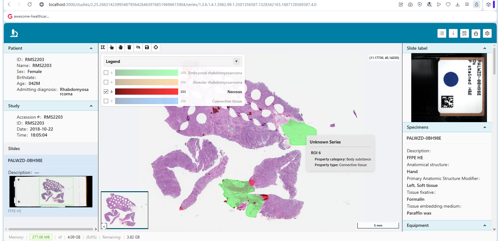

# One binary. From a $50 Pi to a terabyte of RAM.

**In digital pathology, the file that broke our server was 13 gigabytes.**

A single whole-slide image - 161,191 tiles, JPEG 2000 Lossless - landed on a
test machine with **2 GiB of RAM**. The server died of out-of-memory. We did
not patch that one file. We rewrote the rule.

*One archive, three object types - 7 pyramid levels, 3 AI segmentations, and
a structured report. Clarus serves the whole-slide image, the segmentation
overlaid on it, and the findings - the full pathology story, not just
pixels.*

## The problem was a class, not a file

Any place where a number read from a DICOM file became an allocation size was
a landmine:

- the request body buffered whole into RAM;
- the frame table built by **re-reading the entire 13 GB blob**;
- a crafted `NumberOfFrames = 0xFFFFFFFF` requesting ~240 GB;
- a crafted tile length turning a single GET into a 4 GB allocation;
- a 13 GB upload of empty tiles amplifying into a ~91 GB manifest table.

## The fix was a rule, not a patch

1. **Stream, don't buffer.** Socket to a temp file in 64 KiB chunks - memory
   is O(64 KiB), regardless of file size.
2. **Seek, don't read.** The frame table walks headers only; no pixel byte is
   ever read back.
3. **Hash in the stream.** BLAKE3 is computed during the write - no second
   pass over the file.
4. **Trust no length from the wire.** Every integer from an untrusted stream
   is either a seek offset or bounded by a named config cap before it can
   allocate.
5. **Prove it, don't claim it.** Every hot path carries a zero-allocation gate.

## Three wins, not one

- **OOM is gone.** A 13 GB file in 2 GiB of RAM is no longer a problem.
- **Malicious DICOM is expensive, not fatal.** A crafted file gets an honest
  4xx - the server stays up.
- **It is not slower. It is lighter.** The new path does one full disk pass
  *less* than before.

## Measured, not claimed

We verified the change on an ordinary VMware virtual machine - 3 vCPUs on a
HDD-backed virtual disk - with real-time antivirus scanning the source disk.
The box has 32 GB of RAM, so the memory number below is the design, not luck.

- The 12.5 GB pyramid base ingested in **157.5 seconds**, down from 266 s
  before the change - **about 108 s faster (41%)**, exactly the second full
  pass we removed.
- The whole study - **7 pyramid levels + 3 AI segmentations + 1 structured
  report, 13.9 GB total** - ingested in 165.9 s.
- **Peak memory: 55 MB** for a 13.9 GB upload. That is under half a percent
  of the file size.
- Every digest matched the original byte-for-byte: the streaming hash
  addresses the exact same content the old two-pass hash did.

13.9 gigabytes in. 55 megabytes of RAM. One binary.

The same 13 GB slide ingests identically on a Raspberry Pi and on a Xeon with
a terabyte of memory. That is the product thesis: **one binary, boringly
reliable, from edge to datacenter.**
